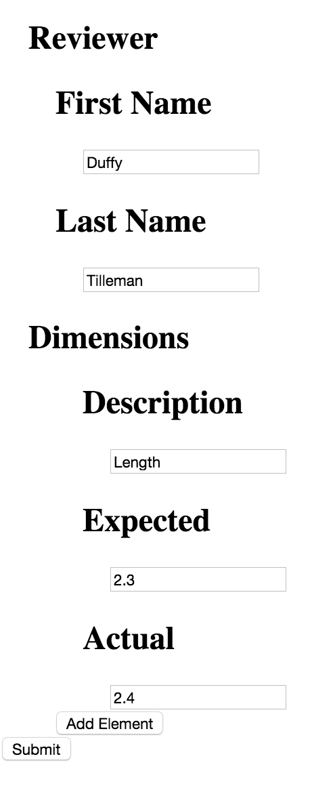

The goal in this coding challenge is to generate an html form from a
[json-schema](http://json-schema.org/). The only element types that need to be supported are
`"object"`, `"array"`, `"string"` and `"number"`. Note that arrays and objects can be recursively
nested in each other. An array element means that the form result can contain
a variable number of sub-elements, each defined in the sub-schema's `items`. You should provide a
button for adding additional items. On form submission, simply output the form contents to
`console.log`

Do not worry about removing items. Do not worry about form validation. Submission of an incomplete
form can be allowed. Recusion may be helpful, although it may be possible to solve without
recursion. If you choose a recursive solution, be aware that Angular has some issues with recursive
directives. The code snippet in [this stackoverflow answer](http://stackoverflow.com/a/18609594) is
helpful. Feel free to use it in its entirety. Also depending on your approach you may find the
[ng-init directive](https://docs.angularjs.org/api/ng/directive/ngInit) helpful.

The json schema to use is in the top level of this project
as [schema.js](schema.js). If you get stuck trying to solve the recursive case, try making a form
generator for simple one-level schema like [this](simple-schema.js). A boilerplate Angular.js
project is provided as well (this repository), but feel free to ignore this repo and start from
scratch if you prefer. In fact, feel free to solve the challenge using tools or frameworks besides
Angular, it may be easier. If you choose to use this repo, run the following commands to start the
development server:

    npm install
    node app.js

The HTML output does not need to be styled, here is a screenshot of an example solution:

And the output of console.log (note this has two dimensions vs the screenshot's one).

    {
      "Reviewer": {
        "First Name": "Duffy",
        "Last Name": "Tilleman"
      },
      "Dimensions": [
        {
          "Description": "Length",
          "Expected": 2.4,
          "Actual": 2.5
        },
        {
          "Description": "Width",
          "Expected": 2,
          "Actual": 2.1
        }
      ]
    }

Output of console.log with no dimensions specified:

    {
      "Reviewer": {
        "First Name": "Duffy",
        "Last Name": "Tilleman"
      }
    }

Also acceptable:

    {
      "Reviewer": {
        "First Name": "Duffy",
        "Last Name": "Tilleman"
      },
      "Dimensions": []
    }
